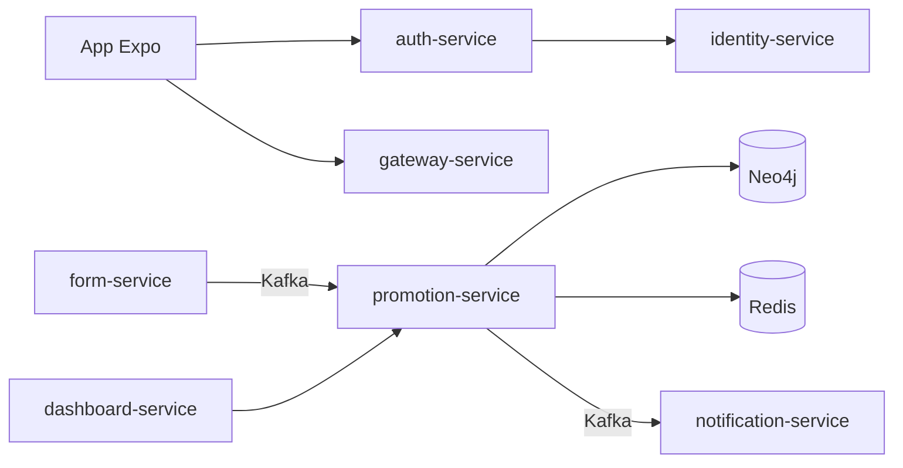

# Arquitectura — CircleGuard

## Visión general

CircleGuard es un sistema de trazabilidad de contactos y contención sanitaria para campus universitario. Usa microservicios Spring Boot, grafo Neo4j para círculos de contacto, Kafka para eventos y PostgreSQL para datos relacionales.

## Microservicios

| Servicio | Puerto | Responsabilidad |
|----------|--------|-----------------|
| circleguard-auth-service | 8180 | Login LDAP/local, JWT, QR |
| circleguard-identity-service | 8083 | Bóveda de identidad anonimizada |
| circleguard-promotion-service | 8088 | Motor de promoción de estado, grafo |
| circleguard-notification-service | 8082 | Email, SMS, push |
| circleguard-form-service | 8086 | Cuestionarios de salud |
| circleguard-gateway-service | 8087 | Validación de acceso QR |
| circleguard-dashboard-service | 8084 | Analytics con k-anonimidad |
| circleguard-file-service | 8085 | Almacenamiento de archivos |

## Flujos principales

1. **Login**: mobile → auth → identity (mapeo anónimo)
2. **Encuesta**: mobile → form → Kafka → promotion (actualiza grafo)
3. **Cercado**: promotion propaga estado → Kafka → notification
4. **Acceso campus**: mobile → gateway (valida QR + Redis)
5. **Dashboard**: dashboard → promotion (stats agregadas)

## Datos

- PostgreSQL: identidad, auth, formularios, dashboard, metadatos promotion
- Neo4j: grafo de contactos y círculos
- Redis: caché de estado para validación en puerta
- Kafka: eventos de estado, encuestas, alertas
